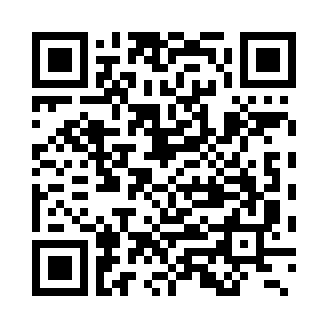

# QRExfiltrate
This tool is a command line utility that allows you to convert any binary file into a QRcode GIF. The data can then be reassembled visually allowing exfiltration of data in air gapped systems. It was designed as a proof of concept to demonstrate weaknesses in DLP software; that is, the assumption that data will leave the system via  email, USB sticks or other media. 

The tool works by taking a binary file and converting it into a series of QR codes images. These images are then combined into a GIF file that can be easily reassembled using any standard QR code reader. This allows data to be exfiltrated without detection from most DLP systems. 

## How to Use 

To use QRExfiltrate, open a command line and navigate to the directory containing the QRExfiltrate scripts. 

Once you have done this, you can run the following command to convert your binary file into a QRcode GIF: 

```
./encode.sh ./draft-taddei-ech4ent-introduction-00.txt output.gif
```

## Demo
`encode.sh <inputfile>`



Where `<inputfile>` is the path to the binary file you wish to convert, and `<outputfile>`, if no output is specified output.gif used is the path to the desired output GIF file. 

Once the command completes, you will have a GIF file containing the data from your binary file. 

You can then transfer this GIF file as you wish and reassemble the data using any standard QR code reader.

## Prerequisites 

QRExfiltrate requires the following prerequisites: 

* qrencode
* ffmpeg

## Limitations

QRExfiltrate is limited by the size of the source data,  qrencoding per frame has been capped to 64 bytes to ensure the resulting image has a uniform size and shape. Additionally the conversion to QR code results in a lot of storage overhead, on average the resulting gif is 50x larger than the . Finally, QRExfiltrate is limited by the capabilities of the QR code reader. If the reader is not able to detect the QR codes from the GIF, the data will not be able to be reassembled. 

> The decoder script has been intentionally omitted

## Conclusion 

QRExfiltrate is a powerful tool that can be used to bypass DLP systems and exfiltrate data in air gapped networks. However, it is important to note that QRExfiltrate should be used with caution and only in situations where the risk of detection is low.
